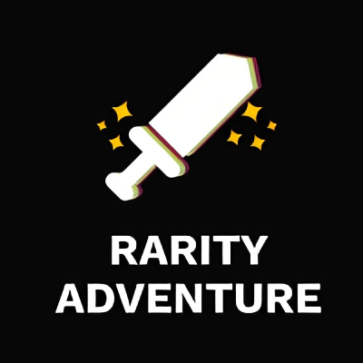

<!-- PROJECT LOGO -->
<br />
<div>
  <div align="center">
    <h1 style="font-weight: bold">Rarity Adventure</h1>
    <a href="https://github.com/rarity-adventure/rarity-frontend">
        
    </a>
    <p align="center" style="margin-top: 30px">
        Rarity frontend provides an interface for players to easily interact with the Rarity game. Rarity is achieved via an active economy, summoners must level, gain feats, learn spells, to be able to craft gear. This allows for market driven rarity while allowing an ever growing economy. Feats, spells, and summoner gear is ommitted as part of further expansions.
        <br /><br />
        <a href="https://rarity.game/">View Website</a>
        ·
        <a href="https://github.com/rarity-adventure/rarity-frontend/issues">Report Bugs</a>
        ·
        <a href="https://github.com/rarity-adventure/rarity-frontend/issues">Request Feature</a>
    </p>
  </div>
</div>

<!-- TABLE OF CONTENTS -->

## Table of Contents

-   [About the Project](#about-the-project)
    -   [Built With](#built-with)
-   [Getting Started](#getting-started)

<br />

<!-- ABOUT THE PROJECT -->
<h2 align="center"> About The Project </h2>

<p>Rarity frontend provides an interface for players to easily interact with the Rarity game. Rarity is achieved via an active economy, summoners must level, gain feats, learn spells, to be able to craft gear. This allows for market driven rarity while allowing an ever growing economy. Feats, spells, and summoner gear is ommitted as part of further expansions.</p>

<br />

<!-- GETTING STARTED -->

## Getting Started

This is an example of how you can set up your project locally. To get a local copy up and running follow these simple example steps.

1. Clone the repo

```sh
git clone https://github.com/rarity-adventure/rarity-frontend
```

2. Start the app

```sh
1. yarn install           # Install dependencies for project
2. yarn start             # Starts the app
```
